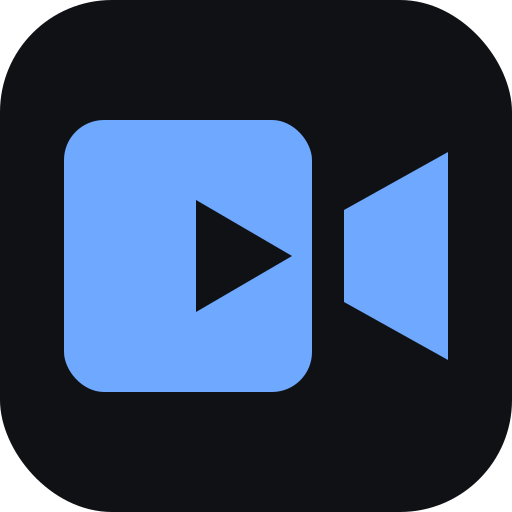

# Video Converter

**English** · [Русский](README.ru.md) · [Українська](README.uk.md) · [Deutsch](README.de.md) · [Français](README.fr.md) · [Español](README.es.md) · [Português](README.pt.md) · [中文](README.zh.md)

Cross-platform desktop app (Windows and macOS) for converting video from one
format to another. Built with **Electron + FFmpeg**. FFmpeg ships inside the
app — the user does not need to install anything extra.



## Features

- Drag and drop files or pick them via a dialog; batch conversion (queue).
- Output formats:
  - **Video:** MP4 (H.264), MKV, MOV, WebM (VP9), AVI (MPEG-4)
  - **Audio:** MP3, M4A (AAC), WAV
  - **GIF animation** from video
- Quality presets (high / medium / low) and resolution scaling
  (up to 4K, 1080p, 720p, 480p, 360p) with aspect ratio preserved.
- Per-file progress, cancellation, and a “Show in folder” button.
- Output folder selection (defaults to next to the original, without
  overwriting the source file).
- **Multilingual interface** — 8 languages (Русский, English, Українська,
  Deutsch, Français, Español, Português, 中文) with automatic system-language
  detection.
- **Light and dark themes** — automatic system-theme detection plus a manual
  override (System / Light / Dark); the language and theme choices persist
  between launches.

## Running in development

```bash
cd video-converter
npm install
npm start          # or npm run dev — with DevTools
```

> On the first `npm install`, the Electron and FFmpeg binaries are downloaded
> (~200 MB).

## Testing the conversion core (no GUI)

Generates a test video and runs it through every format:

```bash
npm run smoke
```

## Building installers

```bash
npm run dist:mac        # → dist/Video Converter-1.0.0.dmg
npm run dist:win        # x64 and ia32 in turn, then ff:restore
npm run dist:win-x64    # 64-bit only:  …-win-x64-Setup.exe
npm run dist:win-ia32   # 32-bit only:  …-win-ia32-Setup.exe
npm run pack            # unpacked build in dist/ (quick check)
```

### Windows architectures

| Arch | Support | Note |
|------|---------|------|
| **x64** | ✅ | primary target — 64-bit Intel/AMD |
| **ia32** | ✅ | 32-bit Windows (rare nowadays) |
| **arm64** | ❌ | `ffmpeg-static`/`ffprobe-static` have no Windows-ARM binaries; ARM devices run the x64 build through built-in emulation |

**Important note on FFmpeg and per-arch builds.** `ffmpeg-static` stores only
**one** binary — for the machine where `npm install` ran. So before building for
a different architecture you need to fetch the matching `ffmpeg.exe`. This is
handled by the `scripts/fetch-ffmpeg.js` script, which is already invoked inside
`dist:win-*`. After a cross-build on a non-Windows machine, restore the native
binary with `npm run ff:restore` (in `npm run dist:win` this happens
automatically at the end). `ffprobe-static` does not need touching — it already
contains binaries for every platform.

**Where to build.** Cross-building the Windows installer on macOS works (tested:
`npm run dist:win-x64` builds the `.exe` without Wine). Building on Windows
itself is also convenient — there `npm install` pulls the right ffmpeg straight
away. The only subtlety of cross-building is a fresh ffmpeg for the target arch
(see above about `fetch-ffmpeg.js`).

### ⚠️ electron-builder version is pinned (24.13.1)

**Do not upgrade `electron-builder` to 24.13.2+ without testing reinstalls.**
24.13.2 introduced a regression (PR #8059): when reinstalling over an older
version, the installer gets stuck on “*… cannot be closed*”, even when the app
is closed and nothing of ours is in Task Manager
([issue #8131](https://github.com/electron-userland/electron-builder/issues/8131)).
That is why `package.json` pins the version exactly as `24.13.1` (the last
working one) rather than via `^`. The `assets/nsis-hooks.nsh` hook additionally
force-closes the app and ffmpeg before installing.

Icons: electron-builder uses `assets/icon.icns` (macOS) and `assets/icon.ico`
(Windows). The repository ships the source `assets/icon.svg` — from it you can
generate the needed formats (for example, via `electron-icon-builder` or an
online converter). If the icon files are missing, the default Electron icon is
used.

## Project structure

```
video-converter/
├── package.json                 # dependencies, scripts, electron-builder config
├── src/
│   ├── main/
│   │   ├── main.js              # main process: window, menu, IPC
│   │   ├── preload.js           # secure bridge (contextBridge)
│   │   └── converter.js         # core: FFmpeg, formats, presets, probe
│   └── renderer/
│       ├── index.html           # UI markup
│       ├── styles.css           # styling, light and dark themes
│       ├── i18n.js              # translations & language switching (8 languages)
│       ├── theme.js             # theme management (system / light / dark)
│       └── renderer.js          # UI logic, queue, progress
├── scripts/
│   ├── fetch-ffmpeg.js          # swaps the ffmpeg binary per target arch
│   └── smoke-test.js            # command-line conversion check
└── assets/
    ├── icon.svg                 # source app icon
    └── nsis-hooks.nsh           # NSIS installer hooks (force-close app/ffmpeg)
```

## How it works

The main process (`converter.js`) calls FFmpeg through `fluent-ffmpeg`, feeding
it the binary paths from the `ffmpeg-static` / `ffprobe-static` packages. The
renderer talks to it only through `preload.js` (`contextIsolation: true`,
`nodeIntegration: false`), so the interface has no direct access to the file
system or Node APIs.

When packaged into `asar`, the FFmpeg binaries are unpacked into
`app.asar.unpacked` (see `asarUnpack` in `package.json`), and their paths are
adjusted in `converter.js`.

## License

MIT (see the `license` field in `package.json`). FFmpeg ships under its own
license (LGPL/GPL) — keep that in mind when distributing.
